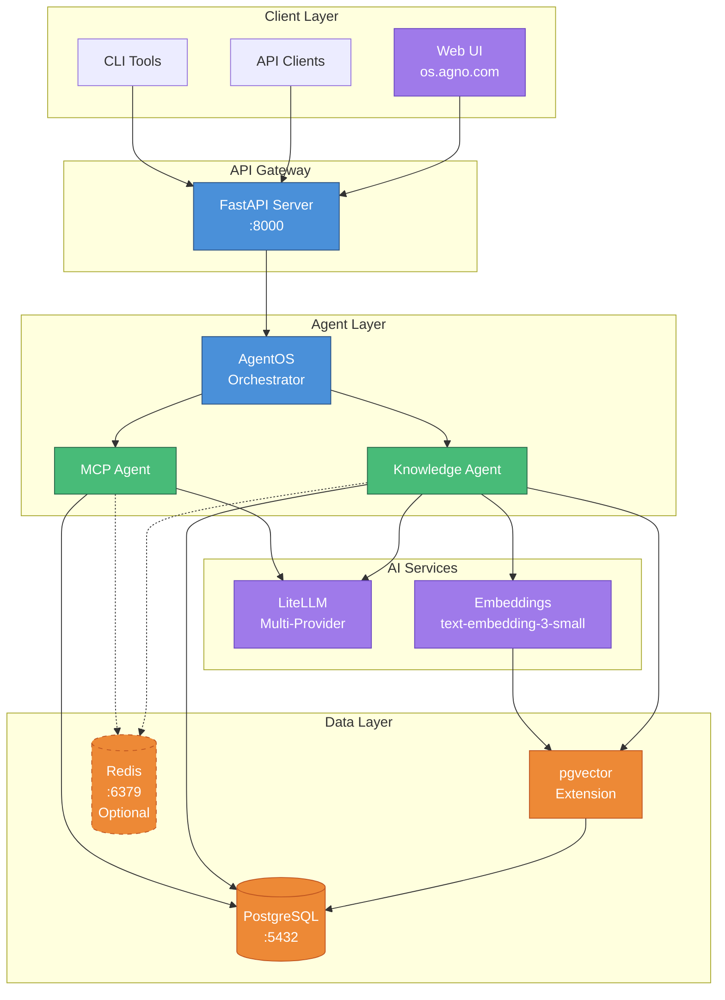
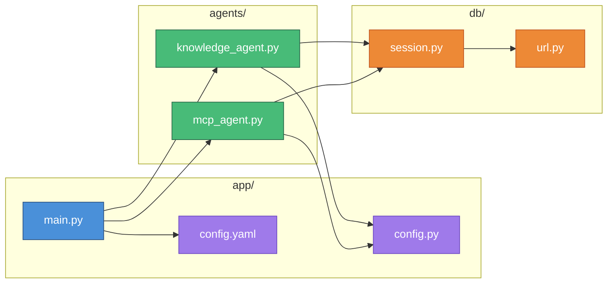
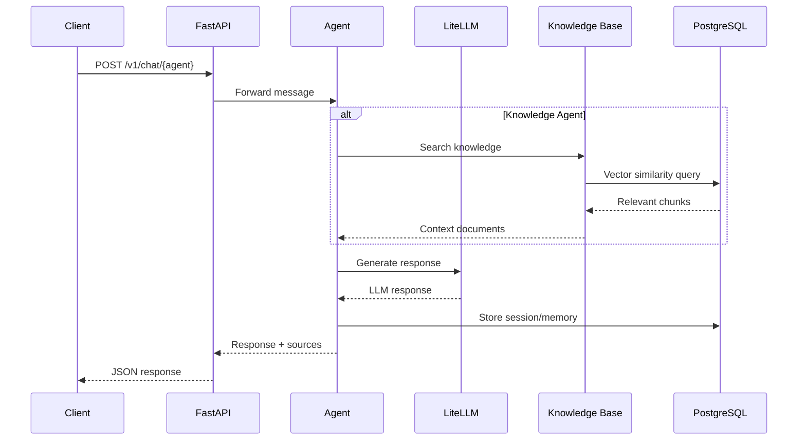
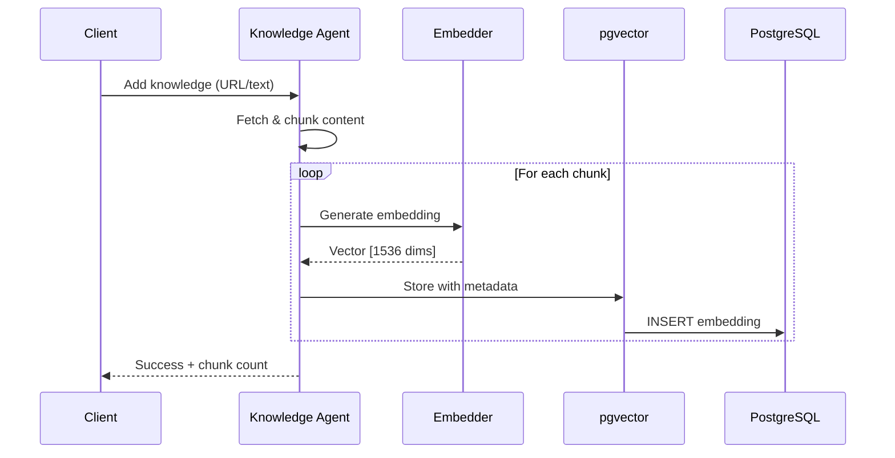
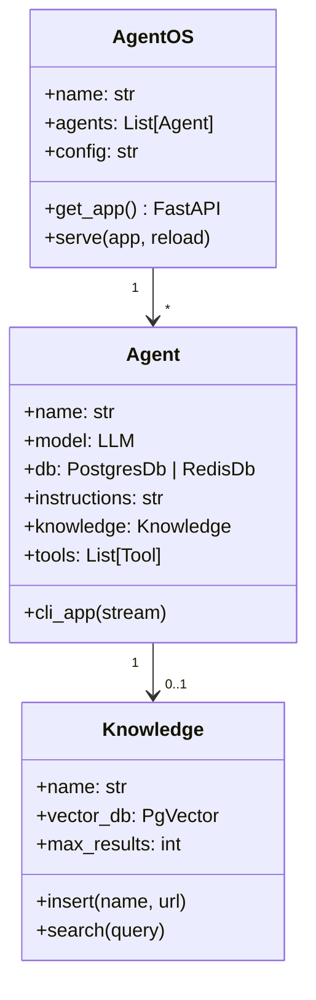
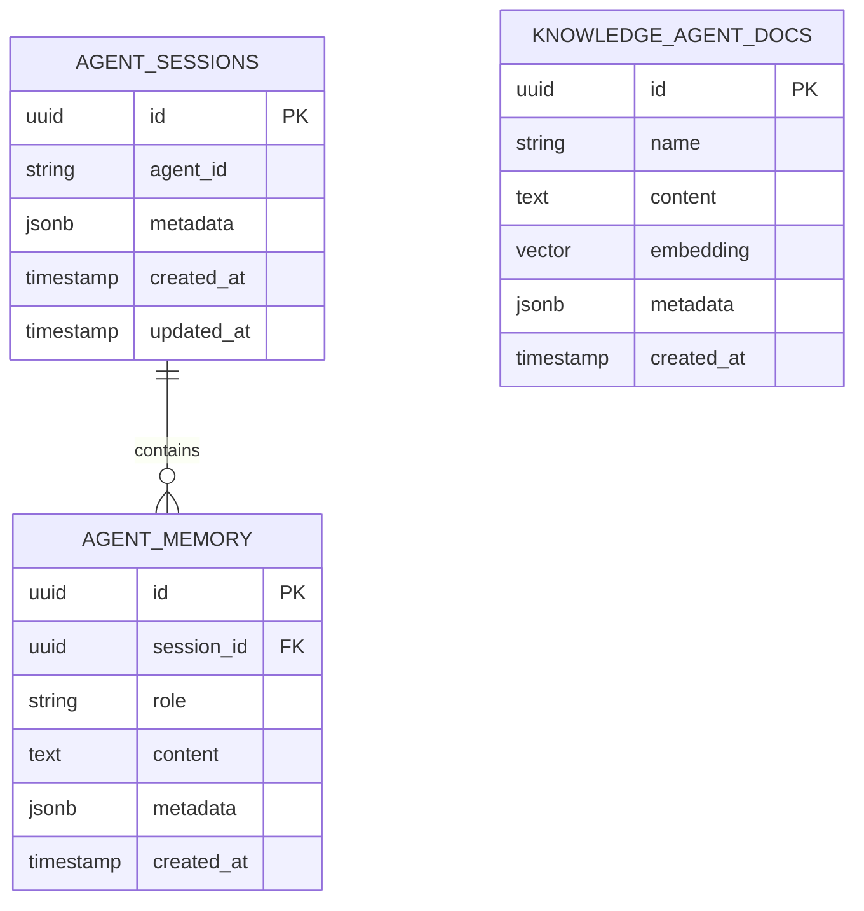
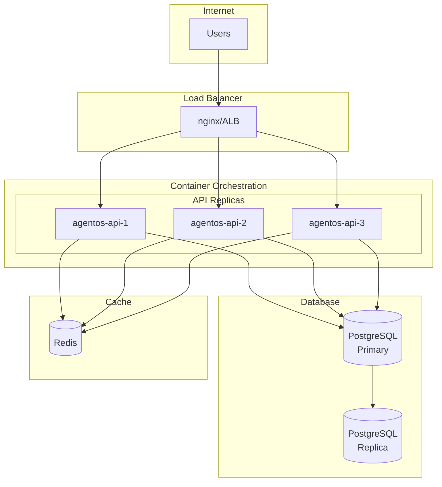
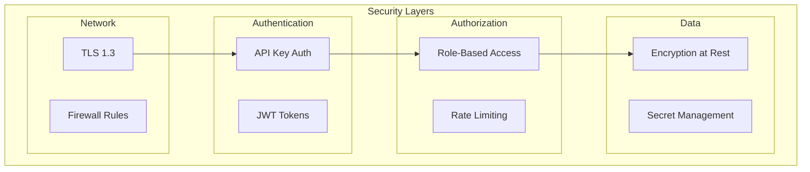
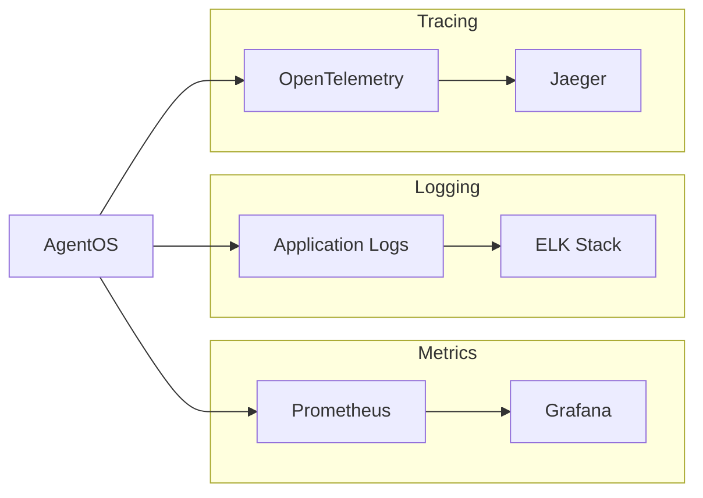

# AgentOS Architecture

This document describes the system architecture, component relationships, and data flows in AgentOS.

## System Overview

AgentOS is a production-ready API template for running AI agents built on the Agno framework. It provides a FastAPI-based web server that exposes AI agents capable of knowledge-based Q&A and tool execution.

## High-Level Architecture



## Component Architecture



## Data Flow Diagrams

### Chat Request Flow



### Knowledge Ingestion Flow



## Component Details

### AgentOS Orchestrator

The central orchestrator that manages agent lifecycle and routing.



### Database Schema



## Deployment Architecture

### Docker Compose Stack

```mermaid
graph TB
    subgraph "Docker Network: agentos"
        subgraph "agentos-api"
            FastAPI[FastAPI<br/>uvicorn]
            Python[Python 3.12]
            AppCode[/app volume]
        end

        subgraph "agentos-db"
            Postgres[PostgreSQL 18]
            PGVector[pgvector ext]
            DBData[/pgdata volume]
        end

        subgraph "agentos-redis [Optional]"
            RedisServer[Redis 7]
            RedisData[/redisdata volume]
        end
    end

    subgraph "External"
        Host[Host Machine]
        LiteLLM_API[LiteLLM API/Proxy]
    end

    Host -->|:8000| FastAPI
    Host -->|:5432| Postgres
    Host -.->|:6379| RedisServer
    FastAPI -->|internal:5432| Postgres
    FastAPI -.->|internal:6379| RedisServer
    FastAPI -->|HTTPS| LiteLLM_API

    classDef container fill:#4a90d9,stroke:#2c5282,color:#fff
    classDef volume fill:#48bb78,stroke:#276749,color:#fff
    classDef external fill:#9f7aea,stroke:#6b46c1,color:#fff
    classDef optional fill:#4a90d9,stroke:#2c5282,color:#fff,stroke-dasharray: 5 5

    class FastAPI,Python,Postgres,PGVector container
    class RedisServer optional
    class AppCode,DBData,RedisData volume
    class Host,LiteLLM_API external
```

### Production Deployment



## Technology Stack

| Layer | Technology | Purpose |
|-------|------------|---------|
| API Framework | FastAPI | High-performance async web server |
| Agent Framework | Agno | AI agent orchestration |
| LLM Provider | LiteLLM | Multi-provider model gateway (SDK or Proxy) |
| Embeddings | text-embedding-3-small | Vector embeddings for search |
| Database | PostgreSQL 18 | Primary data store + knowledge base |
| Vector Search | pgvector | Similarity search extension |
| Session Storage | PostgreSQL / Redis | Agent sessions (Redis optional) |
| Container | Docker | Application packaging |
| Orchestration | Docker Compose | Local development stack |
| Dev Workflow | mise | Python/venv/task management |

## Security Architecture



## Scalability Considerations

### Horizontal Scaling

- **API Layer**: Stateless, can scale horizontally behind load balancer
- **Database**: Read replicas for query distribution
- **Vector Search**: Partitioning by tenant/namespace

### Performance Optimization

- **Connection Pooling**: SQLAlchemy with `pool_pre_ping`
- **Async Operations**: FastAPI async endpoints
- **Caching**: Optional Redis for session storage (start with `--profile redis`)
- **Streaming**: SSE for real-time responses
- **Configuration**: Environment-driven model selection (per-agent or default)

## Monitoring & Observability



## Future Architecture

Planned enhancements:

1. **Multi-tenancy**: Isolated agent environments per tenant
2. **Agent Teams**: Collaborative multi-agent workflows
3. **Event Sourcing**: Full audit trail of agent interactions
4. **Plugin System**: Dynamic tool loading
5. **Federation**: Distributed agent networks
